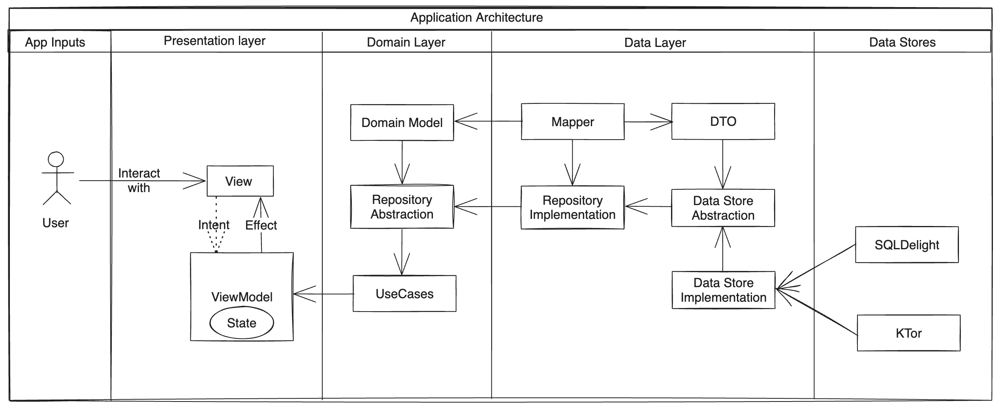

# Furtastic-MVI

This repo is a playground about best practices, using updated libraries and solutions in the Android world!

## ⚙️ Architecture

The main architecture of code based on MVI + CLEAN architecture.

## 🛠 Technologies

- Jetpack Compose
- CLEAN architecture
- MVI architectural pattern
- Coroutine Flow
- SqlDelight database
- Koin
- Navigation
- Ktor
- Version catalog

## App

https://github.com/geetgobindsingh/Furtastic-MVI/assets/8836820/0bfc3bae-ddf0-4de6-85f3-4a5b7bfef26d

## Architecture

## 🤝🏻 Contribute

Any PRs are very welcome! 😍 You can fix a bug, add a feature, optimize performance and even propose a new cool approach in code-base architecture. Feel free and make a PR! 😌
